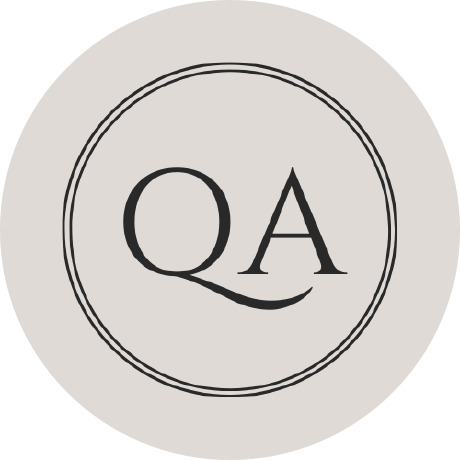

<h1 align="center">Hi 👋, I'm Cihat Köse</h1>

  

<strong>Quality Assurance · Test Automation · Backend Programming</strong>

<!-- 

	

 -->

<h2 align="center">⚖️ From Law to Software Quality</h2>

<ul>
<li>🧑‍💻 <strong>ISTQB® Certified Software QA Engineer</strong> with hands-on testing experience in the Norwegian public sector.</li>
<li>⚖️ Former <strong>Judge</strong>, bringing legal precision into tech and public service.</li>
<li>📚 Background in <strong>Law</strong>, <strong>Sociology</strong> and <strong>Technology</strong>, <em>understanding systems, people, and their interaction.</em></li>
<li>🧩 Skilled in <strong>test automation, documentation</strong> and interdisciplinary collaboration.</li>
<li>💡 Passionate about <strong>tech, inclusion and public value</strong>, building solutions that matter.</li>
<li>📍 Based in Trondheim, Norway, contributing to digital public services across locations.</li>
</ul>

<h2 align="center">🏛️ Public Sector Experience</h2>

<em>Blending public service, technology, and quality assurance.</em>

<ul>
<li>
  <strong>Overingeniør / Testansvarlig @ 
    <a href="https://www.skatteetaten.no/">Skatteetaten</a>
  </strong> (2025–present) – Test coordination and quality assurance for
  <a href="https://www.skatteetaten.no/om-skatteetaten/fremtidens-innkreving/">Fremtidens Innkreving</a>,
  the programme modernising public debt collection in Norway. Working from the Trondheim office with a cross-functional team based in Mo i Rana.
  Joined through <a href="https://www.trondheim.kommune.no/karrierekraft/">Karrierekraft</a>.
</li>

  <li>
    <strong>Criminal & Civil Court Judge – Council of Judges and Prosecutors of the Republic of Türkiye</strong> 
    (2013–2016): Led legal reasoning, case handling, and public decision-making.
  </li>

  <li>
    <strong>Military Prosecutor – Turkish Armed Forces</strong> 
    (2012–2013): Managed investigations and represented military prosecution in criminal trials.
  </li>
</ul>

<h2 align="center">🎓 Education</h2>

<ul>
  <li><strong>Backend Programming</strong> – <a href="https://www.gokstadakademiet.no/">Gokstad Akademiet</a> (2025–present, 2nd year, distance learning)</li>
  <li><strong>LLB, Law</strong> – Ankara University</li>
  <li><strong>BA, Sociology</strong> – Istanbul University</li>
</ul>

<h2 align="center">🧑‍🏫 Teaching & Mentoring</h2>

<ul>
  <li><strong>QA Instructor & Mentor @ <a href="https://technostudy.com.tr/" target="_blank">Techno Study</a></strong> – Taught and mentored QA students (Java, Selenium, Agile/Scrum, and more) through real-world testing projects.</li>
</ul>

<h2 align="center">🏅 Certifications & Achievements</h2>

	
	

<h2 align="center">🛠️ Tools & Technologies</h2>

<h3 align="center">🚀 Programming, Test Automation & Frameworks</h3>

&nbsp;
&nbsp;
&nbsp;
&nbsp;
&nbsp;
&nbsp;
&nbsp;

<h3 align="center">📡 API, Backend Testing & Observability</h3>

&nbsp;
&nbsp;
&nbsp;
&nbsp;
&nbsp;
&nbsp;
&nbsp;
&nbsp;

<h3 align="center">♿ Accessibility & UX Testing</h3>

&nbsp;

<h3 align="center">🤝 Collaboration & DevOps</h3>

&nbsp;
&nbsp;
&nbsp;
&nbsp;
&nbsp;
&nbsp;
&nbsp;

<h3 align="center">📚 Exploring / Learning</h3>

<!-- &nbsp;
&nbsp; -->
&nbsp;
&nbsp;
&nbsp;
&nbsp;

<h2 align="center">📊 GitHub Stats</h2>

A snapshot of my public GitHub activity and project work.

  
  
  

<h2 align="center">📬 Let's Connect</h2>

  
  
  

	Let's connect through community, collaboration, or meaningful tech events!

   

